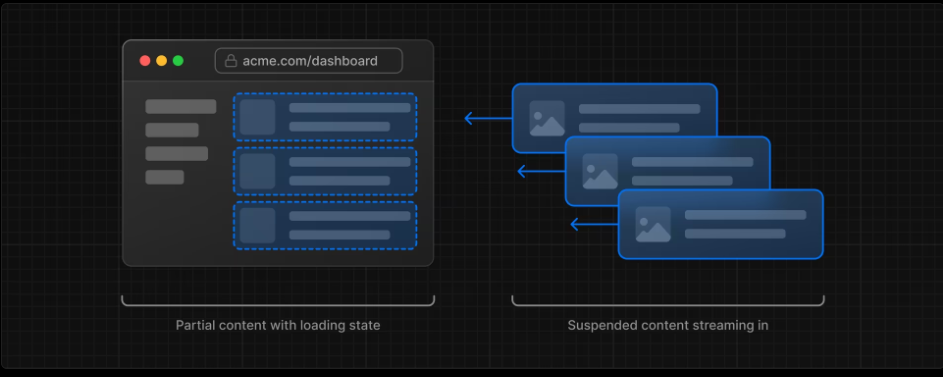

### Chapter 2 - CSS and styling
1. To add global css to the project, import the global.css file into the root layout.tsx file. This allows tailwing utility classes to be applied to our entire app.
2. Another way applying styles is to use CSS modules. Classes created in one module.css files are given unique identifiers to prevent conflicts. 
3. **clsx** is a package which helps in conditionally applying classess to the className props. 
```tsx
    className={clsx(
     'inline-flex items-center rounded-full px-2 py-1 text-xs',
     {
       'bg-gray-100 text-gray-500': status === 'pending',
       'bg-green-500 text-white': status === 'paid',
     },
   )}
// The clsx() function takes in multiple arguments. We can pass classname strings as object keys, and their values being boolean which decides whether the class gets applied or not
```
### Chapter 3 - Fonts
1. Next comes with google fonts pre installed. At build time, Nextjs downloads all the fonts and serves them as static assets so as to prevent extra network requests.
2. To use a font, create a single font.ts file. Import the font from `import {Inter} from 'next/font/google`
```ts
    export const inter = Inter({subsets : ['latin']})
```
**Image optimization with `<Image>`** 
    - Prevents layoutshifts when the image is being loaded
    - Lazy loading of images that are out of user's viewport
    - Uses mordern extensions like .webp, which are more efficient than the traditional extensions
Note: All the images that are in public folder will be statically served therfore they can be referenced directly 

### Chapter - 4 "Layouts" and Pages
- **Layout.tsx** : They're used to wrap all the pages in a single route and provide them a common layout. For eg, `/dashboard   /dashboard/customers   /dasboard/invoiced` 
- Export a react component and make it accept a **children** prop. We can use this feature to make multiple pages share a common navigation component. 
- One benefit of layouts is that on navigation, only the page content is re-renderd while the layout itself remains unchaged
- This is also called **Partial rendering**
- The layout.tsx file that is on the topmost level of /app is called root layout. It is used to modify the tags like html, body and add metadata for better SEO

### Chapter - 5 Links 
- `import Link from 'next/link`
- This component is used to give the website a SPA feel. (no full page refresh between routes)
- Next does something called code splitting by route segements. Meaning each page becomes isolated. 
- In production, whenever a <Link> component comes into viewport, Nextjs **pre-fetches** the data of that page in background. Which makes the page transition 'near instant' 
**Showing active links** : `import {usePathname} from 'next/navigation `
    - `const pathname = usePathname()` The value returned by this hook can be compared with the href value of each link tag, to apply conditional classes to it

### Connecting To DB
- Created a postgres database from vercel's dashboard. It uses Neon.tech under the hood. 
- Then obtain the database URIs and other secret keys from .env.local tab which is found under storage tab
- Put those into the .env file
- app/seed directory contains a route.ts file, which contains an endpoint to seed the database
- They're using '@vercel/postgres' package to connect with the DB which is using node-postgres package under the hood
- You can also use an ORM like prisma 

## Fetching data 
- For data fetching and interact with DB we can either create an **API layer** or Directly fetch data inside **Server components**. 
- Server component functions can be made async, therfore we can await database queries inside them
- Never place the code that interacts with DB (business logic) inside client components since all client side code is exposed to the end user. 

## Database queries 
- Two ways to query the DB 
1. Using SQL (using some JS sql library and writing pure SQL queries) 
2. Using an ORM (prisma, drizzle)   even these orms generate sql under the hood. 

## Vercel Postgress SDK-  [@vercel/postgress](https://vercel.com/docs/storage/vercel-postgres/sdk) 
- It is compatible with the "pg" (node-postgress) library and provides different ways to interact with the DB
**sql (recommended)** **db** **createclient()** 

## sql 
```ts
    import {sql} from '@vercel/postgres'
    const likes = 10
    const {rows} = sql`
    SELECT *
    FROM posts
    WHERE likes > ${likes}
    `
```
- The **sql** is a tag function. Meaning we can't call it like an normal function using parentheses, instead it accepts a string template literal which contains sql code.
- To prevent **sql injections**, this string is converted into a postgres parameterized query by this "sql" function behing the scenes  
- Another thing to be noted here is that we don't need to explicitly connect with the databse using the connection string. 'sql' function will automatically pick up the process.env.POSTGRES_URL
- NOTE: All the data fetching code is located in /app/lib/data.ts
- NOTE: /app/lib/definitions.ts file is defining the shape of data that we expect to come out of a DB query. When using ORMs, defining types like this is not needed. 

## Request Waterfalls
```ts
    const revenue = await fetchRevenue()
    const latestInvoices = await fetchLatestInvoices()
    const {
        numberOfCustomers,
        numberOfInvoices,
        totalPaidInvoices,
        totalPendingInvoices,
    } = await fetchCardData()
```
- Making sequential reuqests in this way creates a **request waterfall** 
- A waterfall is a situation where one reuqest must wait untill the previous request is finished. 
- This pattern, although usefull in some cases, can lead to significantly slow down the page load time. 

## Parallel data fetching
- One way to avoid request waterfalls is to initialize all requests at the same time instead of sequential using `const data = await Promise.all([array of promises])`
- and access each promise's data using appropirate array index

## Chapter - 8 Static and Dynamic rendering
-  The current dashboard is static, meaning any changes to the data in DB won't reflect in this page automatically
**Static rendering** : Data fetching and rendering happen at the server during build time, or when revalidating data. It has some beneifts like :- 
    - Faster page loading
    - Reduces server load (not having to refetch on every single request)
    - Better SEO (content is already available when the page loads for the crawlers)

**Cons of SSR**: Bad for situations where real time data is needed( like a personal dashboard ) Good for UI with little to no data, or data that is shared globally by all users. 

### Dynamic rendering 
Instead fetching and rendering at build time, it is done at request time. Meaning every time the user makes a request, the server will fetch the latest data for them 
**PROS** : 
  - Real time data 
  - User specific content
  - Request time info : like Cookies and url search parameters. Since server doesn't know these things in advance 


## Streaming 

- It is a technique where instead of waiting for all components, that rely on some async operation, to render all at once, we render them individually as soon as their async operation is finished
- In out context, let's say the data fetching for **LatestInvoice** component finishes first. Instead of waiting for other components we render it immidiately.
- This way user can interact with the parts of the page that have been loaded, instead of blocking the whole page. 

**2 ways** : 1.Add a loading.tsx page, for page level streaming.   2.Use **Suspense** component for component level streaming

### Streaming using Loading page
- Imported the pre made skeletons for dashboard page and rendering it inside the loading.tsx file
- Nextjs will automatically render this file as soon as the routes that belong to /dashboard enter into a loading state.
- NOTE: to make sure that this loading state is only applied to the dasboard and not other routes in the /dashboard group, make another folder with rout group naming `(overview)`
- And move page.tsx and loading.tsx that belong to dashboard folder, into this new folder. This makes sure that this loading.tsx file is local to /dashboard route and not /dasboard/anythingElse

## Streaming Components - Suspense api
- Suspense allows you to defer the rendering of component untill the data is fetched. It also accepts a fallback prop, which is another JSX component that can be rendered while the data is being fetched.
- In our context, instead of fetching revenue in dashboard page, we're now fetching it inside RevenueChart component. And using Suspense to show some fallback content while fetching is in loading state
```tsx
   <Suspense fallback={<RevenueChartSkeleton />}>
      <RevenueChart />
  </Suspense>
```
**Setting Suspense boundaries** 
- Most common pattern is to move the data fetching down to the component that needs it and then wrap that component inside Suspense and render some fallback skeleton or other loading state.
- Whole page loading are also fine, but sometimes, one component's loading can slow down the loading of entire page. 

## Partial Pre-rendering (PPR) 
- Combining Static and Dynamic rendering and Streaming  in the same route
- Content that does not rely on any data fetching and is commong to all users can be made static (example Sidenav). They're usually placed inside the layout.tsx file
- Content that changes often and is personalized according to each user is put inside dynamic components.

**Partial Pre Redering** : It's experimental, first introduced in Nextjs14. Combines Static and Dynamic content into one single route. 
- In this approach, a **Static Route Shell** is rendered which has **holes** in it where dynamic content can load asynchronously. 
- The async holes are streamed in parallel, reducing overall load time of the page 
- This approach **also** makes use of the Suspense component provided by React. The Suspense's fallback content is embedded into the initial HTML along with other Static content. 
- Then all the Static content is Pre-rendered to create this 'static shell'. When the user requests that particular route, they're first served this static shell while the data for dynamic holes is fetched in the background 

### Implementing PPR
1. Enable PPR from next.congif.mjs file 
```ts
  const nextConfig = {
    experimental : {
        ppr : 'incremental'
    }
};
```
2. Then choose a route in which you want this option enabeled. And add export this variable from that route's page.tsx file
```ts
  export const experimental_ppr = true;
```
**And that's it.** //now all the static content, including the fallback content inside Suspense will  be pre rendred as static content
// and dynamic content will be rendered when the user requests them 


## Adding Search and Pagination - /dashboard/invoices route
(useSearchParams, usePathname, useRouter)

### Invoice Search 
- When the user searches for some invoice, we're going to update the URL search params. Using URL search params has couple of benefits (Shareable and Bookmarkable URLs, Analytics and Tracking of User behabvour)
- **useSearchParams** allows you to extract query params in the form of keys and values
- **usePathname** returns the current route path
- **useRouter** is used for navigation on client side, programmatically

**STEPS** :
1. Make the search.tsx component a client component
2. Capture user input using onchange event handler  
3. Update the current url with that value
4. Update the table  to reflect the search query

1. Capturing user's input: Since the <Search /> component is a client component, we use **useSearchParams** hook for getting access to the current url's search params values
3. Then we're creating a new search param object using **new URLSeachParam** which is a web api function used to create and manipulate. 
4. For debouncing, use 'useDebounceCallback()' hook from 'useDebounce' library, which delays the executiong of handleInputChange() function untill the last keystroke
5. To Update the current url programmatically, we use `const {replace} = useRouter()` hook. `replace('updated url')`
6. Inside dashboard page, extract the search params, by making the page component accepting a seachParam pop. (since it's a server component, it will automatically have access to the current url parms)

```ts
    const handleSearch = useDebouncedCallback((term: string) => {
    const params = new URLSearchParams(searchParams)  // URLSearchParams is a web api, let's you create a new searchparam instance and manipulate it's keys
    if (term.trim() !== '') {
      params.set('query', term.trim())
      // console.log(params.toString()) //query="term"
    } else {
      params.delete('query')
    }
    //updates the url without loading, using client side routing form Next
    replace(`${pathname}?${params.toString()}`)
  }, 400)

```

## Mutating data
### Server actions
- Async functions that we can run directly on the server. They eliminate the need to create API endpoints. Instead we can create these async functions and invoke then directly inside either a server component or a client component
- For a function to become a server action, it must be async, and it must have 'use server' directive as the first line in the function body
- A form can be used to trigger a server action, we just need to pass in the function to the action attribute of the normal html form. 
- Server action will automatically receive the formData object 
```ts
  export default function Page() {
  // Action
  async function create(formData: FormData) {
    'use server';
 
    // Logic to mutate data...
  }
 
  // Invoke the action using the "action" attribute
  return <form action={create}>...</form>;
}
```
- Benefit of submitting forms using server actions is that forms will keep working even if the client side javascript isn't loaded or CS javascript is disabled
- In **Nextjs**, with server actions, not only can we mutate the server data, but we can also update the cached data using cache revalidation `revalidatePath(path, 'page')`
```ts
  'use server'
  export const updateInvoice = async (id: string, formdata: FormData) => {
    const rawFormData = Object.fromEntries(formdata)
    const { customerId, amount, status } = UpdateInvoice.parse(rawFormData)
    const date = new Date().toISOString().split('T')[0]

    const result = await sql`
    UPDATE invoices
    SET customer_id = ${customerId}, amount = ${amount.toFixed(0)}, status = ${status}
    WHERE id = ${id}
  `;
    console.log(result.rows)
    revalidatePath('/dashboard/invoices', 'page')
    redirect('/dashboard/invoices')
}
```
- The file that contains server action must have React's **'use server'** directive as the first line
- Every function defined in this file must be async
- By default, the form only passes formdata object to this action function and we can't pass other data like the "id" as shown in this updateInvoice() action
- For this we have to use Javascript's .bind() method to pass in additional parameters
```tsx
  import {updateInvoice} from 'actions'
  const updateInvoiceWithID =  updateInvoice.bind(null, id )
  <form action={updateInvoiceWithID}>
```  
- With this the first argument that'll be passed to updateInvoice will be the 'id', and second argument will be the 'formData' object

## Error Handling in Nextjs
- try/catch inside server actions
- error.tsx file to display an error state on the frontend
- notFound() function and not-found.tsx file to displaying invalid route paths

### adding try/catch
- wrap the async code that is running a sql query into try/catch
- inside catch block, return an object with a message field inside it describing the error. This message will be used to display the error on the frontend
- place the reavalidation and redirect functions outside try catch, this makes sure that they're only invoked if the query successfully comes out of the try block.
- If thrown errors are not caught properly inside server actions, they cause the application to crash
- This is where **error.tsx** file comes in.
- Used to define an error boundary (a component that catches 'Javascript errors' anywhere inside it's child component tree)
- Serves as a catch all, and is used to display a fallback UI incase an error is throw inside the route.
- IF the current route does not have a dedicated error.tsx file, Next will look up the heirarchy(parent routes) untill it finds one.

```tsx
  'use client';
 
import { useEffect } from 'react';
 
export default function Error({
  error,
  reset,
}: {
  error: Error & { digest?: string };
  reset: () => void;
}) {
  useEffect(() => {
    // Optionally log the error to an error reporting service
    console.error(error);
  }, [error]);
 
  return (
    <main className="flex h-full flex-col items-center justify-center">
      <h2 className="text-center">Something went wrong!</h2>
      <button
        className="mt-4 rounded-md bg-blue-500 px-4 py-2 text-sm text-white transition-colors hover:bg-blue-400"
        onClick={
          // Attempt to recover by trying to re-render the invoices route
          () => reset()
        }
      >
        Try again
      </button>
    </main>
  );
}
```
- error.tsx needs to be a client component. So that it can catch errors that occur on client side during hydration
- it accepts 2 props that are automatically passed down to it. An error prop and a reset function prop
- reset function 'resets' the route from which this error originated 

### Handling 404 errors with not found 
- for example a fake id of invoice that does not exist inside our database. /dashboard/invoices/'fakeID'/edit
- `import {notFound} from 'next/navigation'`
- Inside /dashboard/invoice/uuid/edit route, we're making a fetching data from the backend, if the id is fake, it will return an undefined data type
- We can place an if check, and programmatically trigger the render the not-found.tsx file
```ts
  const invoice = await fetchInvoiceWithId(params.id)
  if(!invoice){
    notFount()
  }
```